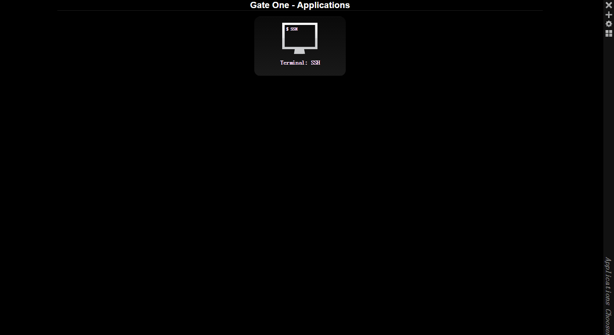
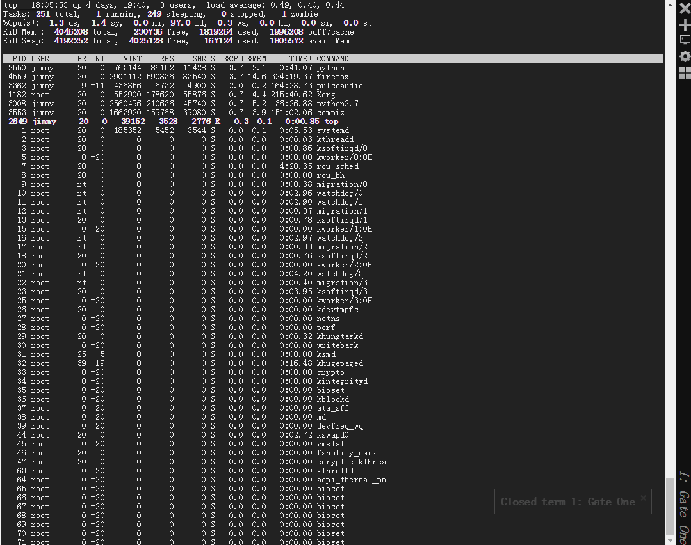

# Announcement
This project is still in beta version. It's been replaced by the new project [webterminal](https://github.com/jimmy201602/webterminal/).
# django-gateone
gateone implemented by django
## Contributing
All contributions are highly encouraged! You can add new features,
report and fix existing bugs and write docs and tutorials.
Feel free to open an issue or send a pull request!
Curently, this project has lots of bug need to be fixed. Due to the limites energy.This project need more contributors.　If you interests in this project please contact me.
# Screenshots


# Docker Build
```sh
docker build --no-cache -t django-gateone:latest .
```
# Docker Run
```sh
docker run -d -p 80:80 --name django-gateone django-gateone
```
# Login Account & Password
```sh
User Account: admin
Password: password!@#
```
